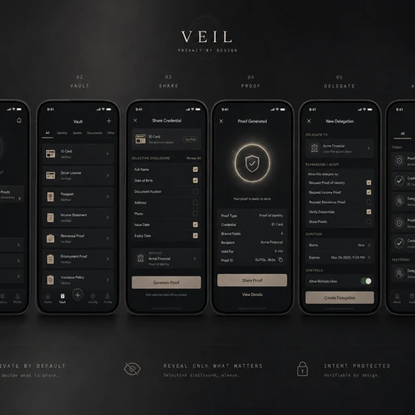

<p align="center">
  
</p>

<h1 align="center">VEIL</h1>

<p align="center"><strong>Unlink by Default. Link by Consent.</strong></p>

<p align="center">A private economic identity layer for the agentic economy — built on Midnight.</p>

---

VEIL lets a verified human operate multiple context-specific economic personas that can prove legitimate authority across digital and physical commerce — without exposing the user's root identity or making every activity linkable by default.

**One verified human. Many economic personas. Linked only when you choose.**

- **Hide the Principal. Prove the Authority.**
- **Accountability at the Root. Unlinkability at the Edge.**
- **Minimum identity. Maximum verifiability.**

**Live site (landing):** https://veil-sigma-lilac.vercel.app/ — the interactive ZK demo runs locally (see below); the static deployment serves the landing only.

## Understand it in 90 seconds

1. Three economic personas — **DAILY / API / DEFI** — belong to one verified principal.
2. Outside observers cannot normally link them to each other.
3. Each persona can independently prove valid economic authority with a real Midnight ZK proof.
4. The owner can selectively link two personas without revealing the root identity.
5. Revocation invalidates future authority.

The future economy may be agent-to-agent and machine-to-machine. Humans should not have to turn their entire economic lives into one globally linkable identity graph to participate in it. VEIL gives the economy verifiable authority without unnecessary identity exposure.

## What VEIL is not

- Not a KYC/AML bypass system. VEIL does not remove compliance — it removes unnecessary disclosure.
- Not a mixer or untraceable payment system. VEIL is not "anonymous spending"; it is accountable, context-specific economic agency.
- Not a Visa/Mastercard replacement, and not an x401/x402 competitor. VEIL does not replace those rails — it gives them a privacy-preserving economic identity layer.

## This repository: the hackathon MVP

**Real Midnight ZK is implemented.** Compact circuits compile, the official Midnight proof server generates proofs, and the Midnight ledger verifies those proofs before the UI reports success. This runs against an **in-memory offline ledger**, not a public network. Credential issuance is mocked; purchases, API billing and swaps are simulated.

<p align="center">
  
</p>

<p align="center">
  
</p>

## Run the real ZK demo

Requirements: Node 22.14+, Midnight Compact compiler **0.30.0**, and Docker with Linux containers (or the official proof-server 8.0.3 binary). Compiler installation: [official Compact guide](https://docs.midnight.network/compact/compilation-and-tooling/dev-tool-usage).

```sh
npm ci
compact update 0.30.0
npm run contract:build
docker compose up -d proof-server
npm run demo
```

Compile in Linux/macOS or a development WSL distribution. Native Windows has an unrelated `compact.exe`; the compile wrapper deliberately rejects it. Initial compilation/proof-server startup downloads public ZK parameters. Wait for the proof server to listen on port 6300.

Open **http://127.0.0.1:43127/** and choose **APP**, or open **http://127.0.0.1:43127/app** directly. No wallet, API key, seed or account is required. Keep the proof server local: it receives private witness data. The app rejects remote prover URLs.

```sh
npm test              # 29 Core / HTTP / landing tests
npm run test:zk       # real proofs + circuit and verifier rejection tests
npm run build         # TypeScript + production frontend
npm start             # serve the built app and ZK Core
```

`dist/` alone is not a complete application. `npm run preview` only serves static assets. Private and public demo state are ephemeral; reset/restart invalidates the current identity and receipts. Missing compiler output or an unavailable prover causes failure, never a signature-only fallback. See [desktop quickstart](docs/DESKTOP-QUICKSTART.md).

## Three-minute walkthrough

1. **Create mock verified root.** The issuer-gated `enroll` circuit proves registration. A random root stays in Core memory; three Compact-hash-derived persona IDs appear.
2. **DAILY:** click **Generate Midnight ZK proof**, then execute the simulated purchase. The receipt shows `authorize`, transaction size, proof timing and transaction digest. A digest alone is not treated as proof: actual transaction bytes are verified.
3. Repeat with **API** and **DEFI**. Open each counterparty view to see only that context's receipt.
4. Select **DAILY + DEFI**, explicitly consent, and generate a **selective link ZK proof**. `linkSelected` proves both derive from the same hidden enrolled root. API is omitted.
5. **Revoke DAILY.** The `revoke` circuit is proved and applied. A later authorization or link involving DAILY is rejected. Root revocation proves revocation for all three known personas.
6. Test replay rejection, an amount above the demo mandate, or expiry after 60 seconds.

## What the proof establishes

- Knowledge of a hidden root whose commitment belongs to the public Merkle tree.
- Domain-separated persona derivation using Compact `persistentHash`.
- Authorization binds that persona, the exact receipt digest and nonce; circuit checks revocation and request replay.
- Selective linking derives both selected personas from the **same** hidden root and checks both are active.
- Revocation requires knowledge of the corresponding hidden enrolled root.
- **Wave 2:** `authorizeWithPolicy` enforces the amount cap **inside the circuit** (`assert(amount <= maxAmount)`). The cap is a public circuit input committed in the proof transcript, so an over-cap request cannot produce a valid proof even if the Core's own pre-checks are skipped or bypassed.

Amount, target, action, consent and receipt expiry remain **Core-enforced policy** for the original `authorize` circuit. They are bound by the receipt digest but are not independently constrained by that circuit. The mock issuer does not prove real-world credential authenticity. The root secret and private witness transcript never enter API responses or source control.

## Verification boundary

`server/midnight.mjs` uses compiler-generated circuits, Midnight proof-server **8.0.3**, Compact runtime **0.15.0**, SDK **4.0.4** and ledger-v8 **8.0.3**. It calls the real prover, binds each transaction, invokes `wellFormed` with **contract/native proof and signature verification enabled**, and applies the verified transaction to the local ledger. The verification endpoint deserializes the submitted transaction bytes and verifies them again against retained historical public state.

Only fee balancing is disabled because this offline demo has no funded wallet. No `mockProve`, fabricated proof or network-finality claim is used. The browser checks the supplemental Ed25519 receipt signature and asks the local Core to verify the Midnight proof; it does not run the ledger WASM verifier itself.

## Concept architecture

<p align="center">
  
</p>

The MVP implements the core loop: Verified Root → Context Personas → Authorization → Unlinkability → Selective Re-Link → Revocation. The full system vision extends this into delegation, coordination and trust outputs across composable rails (x401/x402, cards, DeFi, bank rails) — VEIL composes with rails rather than replacing them.

## Brand

<p align="center">
  
</p>

<p align="center">
  
  
  
</p>

<p align="center">
  
</p>

A veil does not erase the person behind it. It controls what becomes visible, to whom, and when. All brand assets live in [`docs/assets/`](docs/assets/).

## Wave 2 delta (2026-10) — baseline vs. new work

**September baseline (Midnight Korea Hackathon):** 4 Compact circuits (`enroll`, `authorize`, `linkSelected`, `revoke`), proof-server verification, in-memory offline ledger. Policy (amount/action/expiry) enforced by the local Core and bound via the receipt digest.

**New in Wave 2:**
- `authorizeWithPolicy` circuit: the amount cap is asserted **inside the circuit**. Over-cap requests are rejected by the proof itself, with no Core pre-check in the path (`scripts/zk-smoke.mjs`: `circuit-policy-cap-enforced` / `circuit-policy-cap-rejected`).
- The enforced cap is a disclosed public input, committed in the proof transcript and bound into the `VEIL/policyAuth/v1` authorization record.
- The September baseline circuits are untouched; the new circuit is purely additive.

## Roadmap

- **Phase 0 — Hackathon (this repo):** Midnight proof core, three personas, three contexts, selective link proof, revocation.
- **Phase 1 — Developer prototype:** `veil-sdk`, x401/x402 adapters, wallet abstraction, remote encrypted Desktop Core.
- **Phase 2 — Mobile product:** native client, TEE proving, offline pre-authorized capabilities, NFC/QR commerce flows.
- **Phase 3 — Financial integrations:** regulated credential issuers, payment token providers, DeFi/RWA adapters.
- **Phase 4 — Agent/machine economy:** agent-to-agent personas, vehicle/robot identities, credential federation.

## Privacy and remaining work

The trusted Desktop Core knows all persona relationships. The demo has one enrolled root, so its anonymity set is one; it demonstrates the circuit mechanism, **not production anonymity**. Timing and other metadata can still correlate actions. A selected-link disclosure cannot be undone after someone observes it.

The owner API and verifier screens share one local origin. Do not expose them publicly. Encrypted phone pairing, independent external verifiers, authenticated agent keys, private mandate circuits, durable revocation, a funded wallet and public-network deployment remain future work. Native mobile apps and real settlement are out of scope.

## Source map

- `contracts/veil.compact`: four real provable circuits.
- `server/midnight.mjs`: proof generation, actual ledger verification and state transitions.
- `server/zk-core.mjs`: serialized ZK-backed authorization / link / revocation flow.
- `server/core.mjs`: receipt signing and execution policy; also tested independently.
- `server/http.mjs`: loopback API and frontend server.
- `src/`: React/TypeScript owner and verifier UI; PWA assets in `public/`.
- `scripts/zk-smoke.mjs`: positive proofs and negative circuit/verifier tests.
- `docs/assets/`: brand and concept imagery used above.

See [security boundaries](docs/SECURITY.md), [validation](docs/VALIDATION.md), [desktop quickstart](docs/DESKTOP-QUICKSTART.md), and [contract details](contracts/README.md). Hosting, recording and submitting the hackathon form are not performed by this repository.
